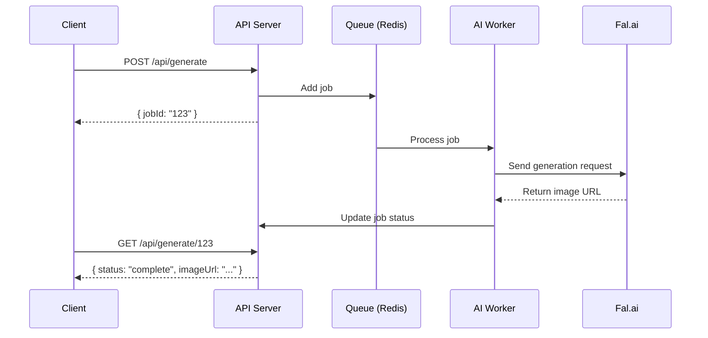

# Product Requirements Document (PRD): Trace

**Version:** 2.0 (The "Fuser-Killer" Update)  
**Status:** Approved for Development  
**Author:** Team Antigravity  

---

## 1. Executive Summary

**Trace** is an AI-first visual workflow platform that combines a **Node-Based UI** with a **Generative AI Pipeline**. It's a beautiful web interface for complex AI workflows, enabling users to create stunning visuals by connecting nodes in an infinite canvas.

**Core Value Prop:** "Connect Nodes. Generate Magic."

### The Three Pillars
1. **The Canvas (UI):** A drag-and-drop node editor for building AI workflows visually
2. **The Orchestrator (Logic):** Backend that interprets the graph and executes the pipeline
3. **The Engine (AI):** Generative AI models (Flux, Stable Diffusion, ControlNet) that produce the output

---

## 2. Product Vision

* **For Creators:** A visual playground where connecting images, prompts, and effects creates AI-generated art
* **For Designers:** A mockup tool that realistically applies logos/graphics to products (shirts, mugs, etc.)
* **For Developers:** An extensible platform to build custom AI nodes and workflows
* **For Agencies:** A production-ready tool for generating marketing visuals at scale

---

## 3. Tech Stack

### Frontend (The Canvas)
| Technology | Purpose |
|------------|---------|
| **React + Vite** | Fast, modern SPA framework |
| **@xyflow/react (React Flow)** | Industry-standard node-based editor |
| **Tailwind CSS** | Modern, responsive styling |
| **Framer Motion** | Smooth animations and transitions |
| **Zustand** | Lightweight state management |

### Backend (The Orchestrator)
| Technology | Purpose |
|------------|---------|
| **Node.js + Express** | API server and authentication |
| **Python + FastAPI** | AI service orchestration |
| **PostgreSQL** | Persistent storage |
| **Redis** | Job queue for async processing |

### AI Engine (The Brain)
| Technology | Purpose |
|------------|---------|
| **Fal.ai API** | Cloud-hosted Flux/Stable Diffusion models |
| **Replicate API** | Alternative model hosting |
| **ComfyUI** | Self-hosted option for power users |
| **OpenAI Whisper** | Audio transcription |
| **ElevenLabs** | Voice generation |

---

## 4. Key User Flows

### 4.1 The "Mockup" Flow (Primary Feature)
```
User uploads product photo → User uploads logo/graphic → 
AI applies graphic realistically with proper lighting/folds → 
User downloads high-res result
```

### 4.2 The "Image-to-Image" Flow
```
User provides base image → User writes prompt → 
AI transforms image based on prompt → 
User iterates with different prompts/settings
```

### 4.3 The "Text-to-Image" Flow
```
User writes detailed prompt → Selects model (Flux/SD) → 
AI generates image → User refines with additional nodes
```

### 4.4 The "Video Documentation" Flow (Legacy SkyDocs)
```
User uploads screen recording → AI transcribes → 
User edits transcript → AI generates step-by-step article
```

---

## 5. Node Types Architecture

### 5.1 Input Nodes
These nodes provide data into the workflow:

| Node Type | Description | Handles |
|-----------|-------------|---------|
| **Image Upload Node** | Upload images with preview | 1 Output (Image) |
| **Prompt Node** | Text input for AI prompts | 1 Output (Text) |
| **Video Upload Node** | Upload video files | 1 Output (Video) |
| **Color Picker Node** | Select colors | 1 Output (Color) |
| **Number Node** | Numeric input (sliders) | 1 Output (Number) |

### 5.2 Processing Nodes
These nodes transform or generate data:

| Node Type | Description | Handles |
|-----------|-------------|---------|
| **Flux Generator** | AI image generation | 2+ Inputs, 1 Output |
| **Image-to-Image** | Transform existing images | 2 Inputs, 1 Output |
| **ControlNet** | Guided image generation | 3 Inputs, 1 Output |
| **Inpainting Node** | Edit specific areas | 3 Inputs, 1 Output |
| **Background Remover** | Remove image backgrounds | 1 Input, 1 Output |
| **Upscaler Node** | Enhance resolution | 1 Input, 1 Output |

### 5.3 Output Nodes
These nodes display or export results:

| Node Type | Description | Handles |
|-----------|-------------|---------|
| **Preview Node** | Display generated images | 1 Input |
| **Download Node** | Export to file | 1 Input |
| **Gallery Node** | Compare multiple outputs | N Inputs |

---

## 6. The "Shirt Mockup" Deep Dive

This is the flagship feature that demonstrates Trace's power.

### How It Works (Technical)

```mermaid
flowchart LR
    A[Product Photo<br/>hoodie.jpg] --> D[Flux + ControlNet]
    B[Logo/Graphic<br/>logo.png] --> D
    C[Prompt<br/>"logo on hoodie"] --> D
    D --> E[Depth Map Analysis]
    E --> F[Surface Normal Check]
    F --> G[Generated Output]
```

### The AI Pipeline

1. **Input 1 (Base):** Photo of the product (e.g., black hoodie)
2. **Input 2 (Overlay):** The graphic/logo to apply
3. **Input 3 (Prompt):** Description of desired result

**AI Processing Steps:**
1. Generate a **Depth Map** to understand folds/curves
2. Use **Surface Normals** to calculate lighting
3. Apply **Inpainting** with the overlay image as reference
4. Generate final image with realistic wrapping and lighting

### API Integration

```json
{
  "model": "fal-ai/flux/dev/image-to-image",
  "inputs": {
    "image_url": "https://app.trace.ai/uploads/hoodie.jpg",
    "overlay_url": "https://app.trace.ai/uploads/logo.png",
    "prompt": "Distressed logo on a black hoodie, cinematic lighting",
    "strength": 0.85,
    "guidance_scale": 7.5
  }
}
```

---

## 7. Frontend Architecture

### 7.1 React Flow Implementation

The core of Trace is powered by `@xyflow/react`:

```javascript
// Graph State Structure
const initialNodes = [
  { 
    id: 'image-1', 
    type: 'imageNode', 
    data: { image: 'hoodie.jpg' }, 
    position: { x: 0, y: 0 } 
  },
  { 
    id: 'prompt-1', 
    type: 'promptNode', 
    data: { text: 'Red vintage logo' }, 
    position: { x: 0, y: 150 } 
  },
  { 
    id: 'flux-1', 
    type: 'fluxNode', 
    data: { 
      label: 'Flux Generator',
      settings: { strength: 0.85, guidance: 7.5 }
    }, 
    position: { x: 300, y: 75 } 
  },
];

const initialEdges = [
  { id: 'e1', source: 'image-1', target: 'flux-1', sourceHandle: 'image' },
  { id: 'e2', source: 'prompt-1', target: 'flux-1', sourceHandle: 'prompt' }
];
```

### 7.2 Custom Node Components

Each node type is a React component:

```jsx
// Example: Image Upload Node
const ImageNode = ({ data }) => {
  return (
    <div className="node-container bg-zinc-900 rounded-xl p-4">
      <Handle type="source" position={Position.Right} id="image" />
      <input type="file" accept="image/*" onChange={handleUpload} />
      {data.image && }
    </div>
  );
};
```

### 7.3 Graph Traversal (Run Button Logic)

When the user clicks "Run":

1. **Find Output Node:** Locate the terminal node(s)
2. **Trace Backwards:** Follow edges to gather all inputs
3. **Build Payload:** Create JSON with all node data
4. **Send to API:** POST to `/api/generate`
5. **Update UI:** Display result in the output node

---

## 8. Backend Architecture

### 8.1 API Endpoints

```
POST /api/auth/register     - User registration
POST /api/auth/login        - User authentication
GET  /api/auth/me           - Get current user

POST /api/workflows         - Save workflow
GET  /api/workflows         - List user workflows
GET  /api/workflows/:id     - Get workflow
PUT  /api/workflows/:id     - Update workflow
DELETE /api/workflows/:id   - Delete workflow

POST /api/generate          - Execute AI pipeline
GET  /api/generate/:id      - Check generation status
POST /api/upload            - Upload files (S3 presigned)
```

### 8.2 Generation Pipeline



---

## 9. Functional Requirements

### 9.1 Canvas Features
- [x] Infinite canvas with zoom/pan
- [x] Drag-and-drop node creation
- [x] Node connection via bezier curves
- [x] Real-time node preview
- [ ] Mini-map navigation
- [ ] Undo/Redo history
- [ ] Keyboard shortcuts

### 9.2 Node System
- [ ] Image Upload Node
- [ ] Prompt Node
- [ ] Flux Generator Node
- [ ] Image-to-Image Node
- [ ] ControlNet Node
- [ ] Background Remover Node
- [ ] Preview/Output Node

### 9.3 AI Integration
- [ ] Fal.ai API integration
- [ ] Replicate API fallback
- [ ] Generation queue system
- [ ] Progress indicators
- [ ] Error handling

### 9.4 User Features
- [x] JWT Authentication
- [x] Project management
- [ ] Workflow saving/loading
- [ ] Export to PNG/JPG
- [ ] Share workflows publicly
- [ ] Usage credits system

---

## 10. Non-Functional Requirements

| Requirement | Target | Notes |
|-------------|--------|-------|
| **Canvas FPS** | 60 FPS | Smooth zooming/panning |
| **Node Render** | < 16ms | No jank during drag |
| **API Latency** | < 200ms | For non-AI endpoints |
| **AI Generation** | < 30s | For standard images |
| **Uptime** | 99.5% | Production target |
| **Mobile** | Responsive | View-only on mobile |

---

## 11. Development Phases

### 🚩 Phase 1: The Canvas (Weeks 1-2)
**Goal:** Users can drag, connect, and arrange nodes on an infinite canvas.

**Deliverables:**
- React Flow setup with custom node types
- Basic node library (Image, Prompt, Output)
- Node connection logic
- Workflow state management (Zustand)
- Dark theme with modern styling

### 🚩 Phase 2: The Mockup Engine (Weeks 3-4)
**Goal:** The "Shirt Mockup" workflow works end-to-end.

**Deliverables:**
- Fal.ai API integration
- Flux Generator node with settings panel
- Image-to-Image pipeline
- Progress indicators and error states
- Download/export functionality

### 🚩 Phase 3: The Full Suite (Weeks 5-6)
**Goal:** Complete node library with advanced features.

**Deliverables:**
- ControlNet node
- Inpainting node
- Background remover node
- Upscaler node
- Workflow templates

### 🚩 Phase 4: Production Polish (Week 7+)
**Goal:** Launch-ready product.

**Deliverables:**
- Usage credits/billing system
- Public workflow sharing
- Team collaboration
- Mobile responsive canvas
- Performance optimization

---

## 12. Success Metrics (KPIs)

| Metric | Target | Measurement |
|--------|--------|-------------|
| **Time to First Generation** | < 5 min | From signup to first AI output |
| **Generation Success Rate** | > 95% | Successful completions |
| **Canvas Performance** | 60 FPS | Chrome DevTools |
| **User Retention (Week 1)** | > 40% | Return within 7 days |
| **Workflow Saves** | > 3/user | Average saved workflows |

---

## 13. Competitive Analysis

| Feature | Trace | Fuser | ComfyUI | Canva |
|---------|-------|-------|---------|-------|
| Node-based UI | ✅ | ✅ | ✅ | ❌ |
| Web-based | ✅ | ✅ | ❌ | ✅ |
| No code setup | ✅ | ✅ | ❌ | ✅ |
| Custom nodes | ✅ | ❌ | ✅ | ❌ |
| Realistic mockups | ✅ | ✅ | ✅ | ❌ |
| Video support | ✅ | ❌ | ✅ | ❌ |
| Self-hostable | ✅ | ❌ | ✅ | ❌ |

---

## 14. Risk Assessment

| Risk | Impact | Mitigation |
|------|--------|------------|
| Fal.ai API rate limits | High | Implement queue + fallback to Replicate |
| Canvas performance on large workflows | Medium | Virtual rendering, node grouping |
| AI generation costs | High | Usage credits, caching similar requests |
| Model quality variations | Medium | Curated presets, quality checks |

---

## 15. Next Immediate Steps

1. **Set up React Flow** with basic node types
2. **Implement Image Upload Node** with preview
3. **Implement Prompt Node** with text input
4. **Implement Flux Node** with Fal.ai integration
5. **Create "Run" button** that traverses graph and triggers generation
6. **Display results** in Preview Node

---

## Appendix: Legacy SkyDocs Features

The original SkyDocs video documentation features are maintained as secondary capabilities:

- Video upload and transcription (Whisper)
- Text-to-video editing (Descript-style)
- Article generation from video
- Screenshot extraction at key moments

These will be integrated as specialized node types in future phases.

---

<p align="center">
  <strong>Trace</strong> - Connect Nodes. Generate Magic.<br/>
  Made with ❤️ by Team Antigravity
</p>